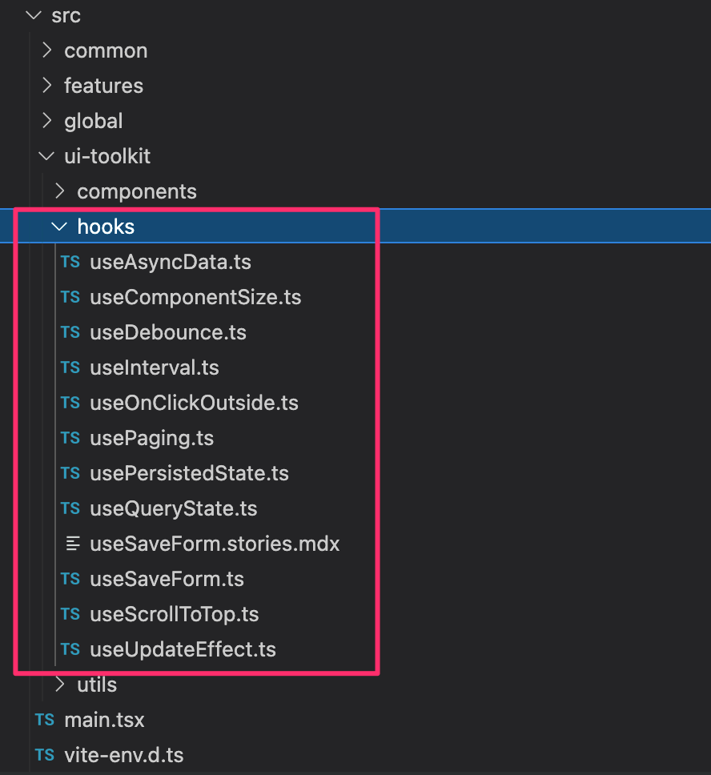

# React TypeScript SPA w/ Vite


- [React TypeScript SPA w/ Vite](#react-typescript-spa-w-vite)
  - [Overview](#overview)
  - [Getting Started](#getting-started)
  - [Project Structure](#project-structure)
    - [`/src` folders](#src-folders)
    - [Root level files](#root-level-files)
  - [Manual Setup Instructions](#manual-setup-instructions)
    - [Create Vite Project](#create-vite-project)
    - [Setup Aliases](#setup-aliases)
    - [Setup global types](#setup-global-types)
    - [Setup Bootstrap CSS](#setup-bootstrap-css)
    - [Setup React Router](#setup-react-router)

## Overview

This starter template leverages the following technologies:

- React
- Vite
- TypeScript
- Bootstrap v5
- React Router v6
- Sass

It also tries to establish a few conventions around folder structure.

## Getting Started

You can make a copy of the starter repo (without the GIT history) by running the following command. This

```
npx degit droopytersen/react-vite-starter my-new-project
```

Then you can `cd` into your project directory and install dependencies and run the app

```
npm install
npm start
```

## Project Structure

### `/src` folders

Most of your application code will be inside of `src`

```
/src
  /common
  /features
  /global
  /ui-toolkit
```

**`/src/global`**

This folder is designated for **things that wrap your entire application**.


Some commonly found items in this folder are:

- App.tsx
- Global styles
- Global layout components (global nav, global footer, etc...)
- Context Providers (AuthProvider, ThemeProvider, etc...)

**`/src/features`**

This folder will have a sub-folder for each distinct "module"(feature) of your application.

How you decide to group your application into features is up to you, but typically it kind of lines up to your application's url paths and/or API paths.

Once in a feature folder, follow the conventions described below to keep things organized.

- `/views`
  - `*View` components are typically what a route will map to
  - `*View` components often handle data fetching
  - `*View` usually stay relatively small and defer most of the rendering to something from the feature's `components` folder.
- `/components`
  - Any components related to the feature
  - Generally prefer to make them "dumb" - aka pass all the data they need in as props.
    - Not a hard and fast rule. Every app will have a couple exceptions.
- `<feature>.types.ts` - any Typescript interfaces/types specific to the feature
- `<feature>.data.ts` - Handles data access and transformation for the feature
  - If you have a lot of data stuff going on for a specific feature, maybe consider breaking it into multiple files inside a `data` folder.

_Feature folder example_


**`/src/common`**

This folder is designated for **non-react things that are leveraged across features**. Common examples include:

- A generic request function make `fetch` calls to your API
- Application specific formatters and validation (`displayDate`, `validatePhone`, etc...)
- Typescript interface/types that are common to all features of your app
- `routes.ts` to store application paths in a single place so it is easier to update urls/paths in the future.

**`/src/ui-toolkit/components`**

This folder is for **generic React components** that aren't specific to a feature (and commonly not even specific to your app).

> The idea is that **components in this folder could easily be dropped into other projects**.

_Example generic components_


**`/src/ui-toolkit/hooks`**

This folder is for **generic React hooks** that aren't specific to a feature (and commonly not even specific to your app).

> The idea is that **hooks in this folder could easily be dropped into other projects**.

_Example generic hooks_



### Root level files

- `.prettierrc` - Allows everyone to share prettier settings so there aren't formatting conflicts.
- `index.html` - Is the main entry point into your app that Vite uses.
- `package.json` - Describes your project and it's dependencies.
- `package-lock.json` - Auto generated my `npm`. It is used to make sure everyone is using the same version of dependencies
- `stats.html` - Open in a browser to examine your bundle size. Auto generated by `rollup-plugin-visualizer` when you `npm run build`.
- `tsconfig.json` - Typescript configuration
- `vite.config.ts` - Vite configuration

## Manual Setup Instructions

If you don't want to clone the template repo, you can create a project from scratch and reference these instructions.

- [x] [Create Vite Project](#create-vite-project)
- [x] [Setup Aliases](#setup-aliases)
- [x] [Setup Global Types](#setup-global-types)
- [x] [Setup Bootstrap CSS](#setup-bootstrap-css)
- [x] [Setup React Router](#setup-react-router)

### Create Vite Project

- Running the following will ask a bunch of questions
- It will create a new folder for you using the specified project name
- When it asks to you **Select a framework**, choose **react**, then choose **react-ts** (if you want to follow along with this instructions)

```
npm init vite
```

### Setup Aliases

In `tsconfig.json` set the paths

```json
{
  "compilerOptions": {
    "paths": {
      "~global/*": ["./src/global/*"],
      "~common/*": ["./src/common/*"],
      "~components/*": ["./src/components/*"],
      "~hooks/*": ["./src/hooks/*"],
      "~features/*": ["./src/features/*"]
    },
  ...
  }
}
```

In `vite.config.ts` setup the `resolve.alias`

```ts
import { defineConfig } from "vite";
import * as path from "path";
import reactRefresh from "@vitejs/plugin-react-refresh";
import { visualizer } from "rollup-plugin-visualizer";

export const viteAliases = {
  "~common": path.resolve(__dirname, "./src/common"),
  "~hooks": path.resolve(__dirname, "./src/hooks"),
  "~components": path.resolve(__dirname, "./src/components"),
  "~features": path.resolve(__dirname, "./src/features"),
  "~global": path.resolve(__dirname, "./src/global"),
};

// https://vitejs.dev/config/
export default defineConfig({
  resolve: { alias: viteAliases },
  plugins: [reactRefresh(), visualizer()],
});
```

### Setup global types

Create a file at `src/types/global.d.ts` and add any global types/interfaces inside the `declare global { }` block.

```ts
export {};

declare global {
  type Environment = "LOCAL" | "DEV" | "UAT" | "PROD";

  type Role = "admin" | "user";

  interface User {
    id: string;
    name: string;
    role?: Role;
    isImpersonation: boolean;
  }

  type ValidationStatus = "none" | "valid" | "invalid";
}
```

### Setup Bootstrap CSS

If you aren't going to create a custom theme, the easiest way is to just link to the CDN inside of `index.html`.

Otherwise, to create a theme you need to setup SASS variables and compile bootstrap as part of your build process.

First install `sass` and `bootstrap`.

```
npm install --save-dev sass
npm install bootstrap
```

Next create the following two files:

```
/src
  /global
    /styles
      global.scss
      theme.scss
```

Inside of `global.scss` put in the following

```scss
@import "./theme.scss";

@import url("https://cdn.jsdelivr.net/npm/bootstrap-icons@1.5.0/font/bootstrap-icons.css");
@import "../../../node_modules/bootstrap/scss/bootstrap.scss";
```

Inside of `/src/styles/theme.scss` put in the following. Feel free to delete the commented code, it is there to help you build a custom theme.

```scss
$theme-colors: (
  "primary": #8a2287,
  // "secondary": $secondary,
  // "success": $success,
  // "info": $info,
  // "warning": $warning,
  // "danger": $danger,
  // "light": $light,
  // "medium": $medium,
  // "dark": $dark,,,,,,,,,,,,,,,,,,,,,,,,,,,,,,,,,,,,,,,,,,,,,,,,,,,,,,,,,,,,
);
// $grid-breakpoints: (
//   xs: 0,
//   sm: 576px,
//   md: 768px,
//   lg: 992px,
//   xl: 1200px,
//   xxl: 1600px,
// );
// $spacer: 2rem;
// $mobile-spacer: 1rem;
```

Import `global.scss` into `global/app.tsx`

```ts
import "../styles/global.scss";
```

### Setup React Router

At the top of of `App.tsx` add the following `import`

```js
import { BrowserRouter, Route, Routes } from "react-router-dom";
```

Next update the main `App` component to be the following

```tsx
function App() {
  // Wrap AppRoutes with any Context Providers you might eventually have
  return (
    <BrowserRouter>
      <AppRoutes />
    </BrowserRouter>
  );
}

function AppRoutes() {
  // By putting AppRoutes in a separate child component
  // you can now consume any wrapped Context Providers
  return (
    <Routes>
      <Route path="*" element={<HomeView />} />
      <Route path="/blog" element={<BlogLayout />}>
        <Route path="/" element={<BlogPostsView />} />
        <Route path=":postId" element={<BlogPostView />} />
      </Route>
    </Routes>
  );
}

export default App;
```
